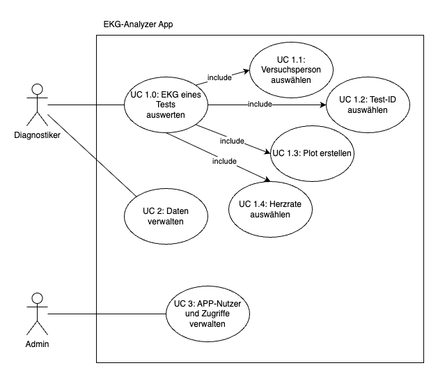
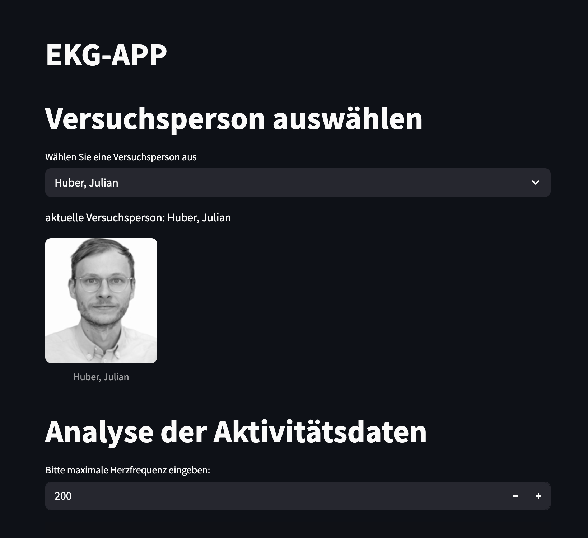
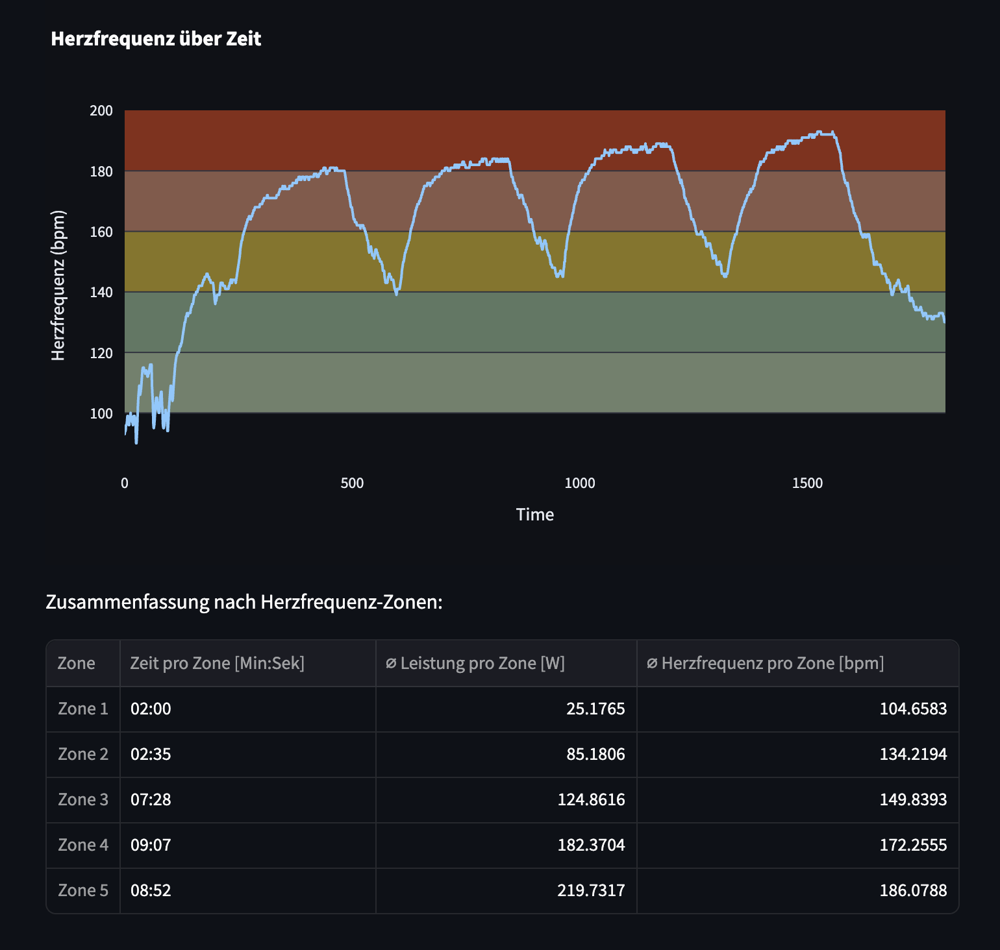
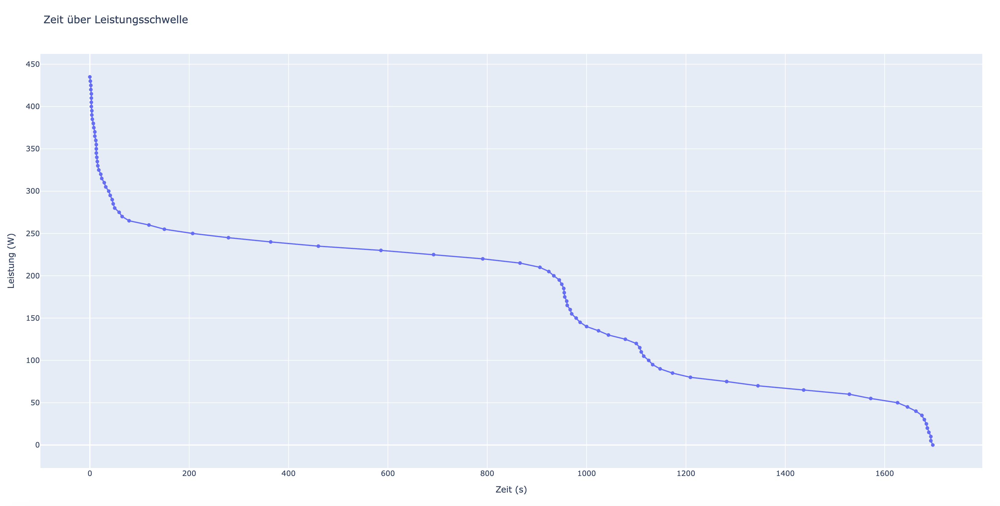
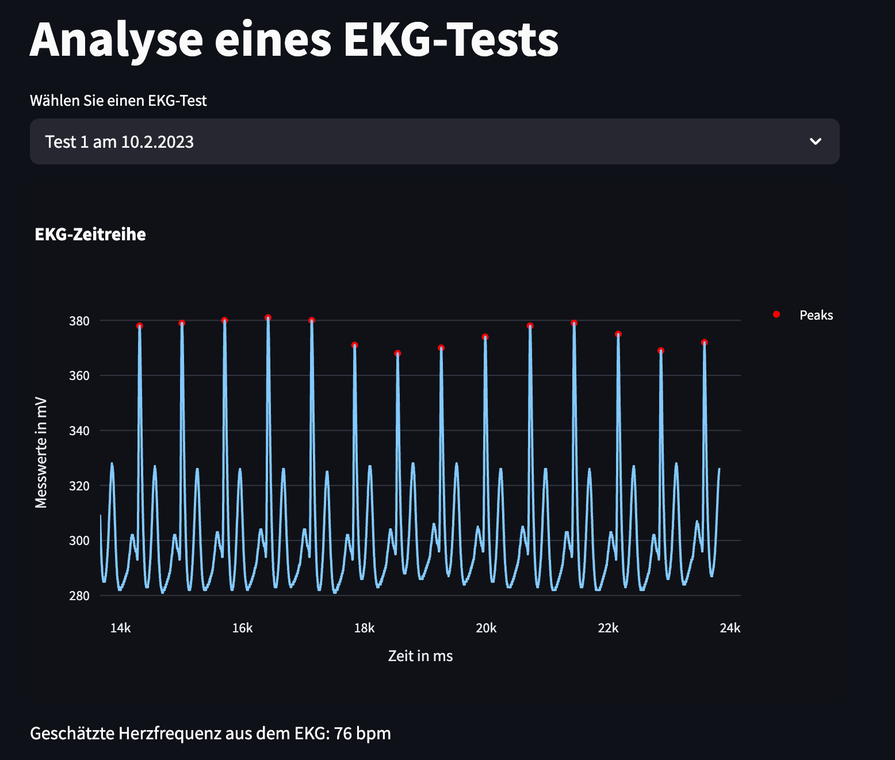
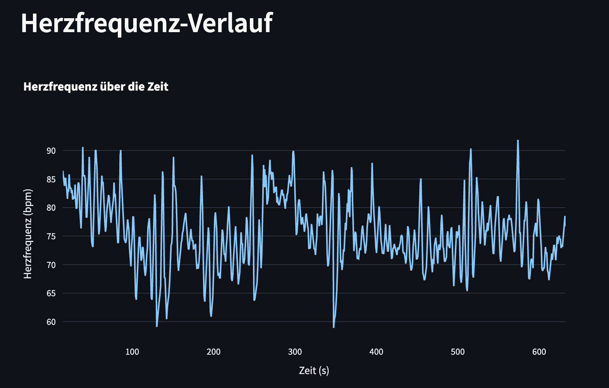

# PUE_GruppeA

# Aufgabe 1

## Projektübersicht 
Dieses Repository liest gegebene Leistungsdaten aus einer CSV-Datei aus, sortiert diese und erstellt dann ein Leistungsdiagramm (Power Curve).

## Nutzung 
Damit der Code genutz werden kann muss zu erst das Repository geklont werden. 

Anschließend muss PDM mit `pdm install` installiert werden. 

## Leistungsdiagramm
Nachdem Sie das Skript ausgeführt haben finden sie das Leistungsdiagramm (Power Curve) unter `figures/power_curve.png`.

## Beispielgrafik


# Aufgabe 2

### UML-Diagramm

Das folgende Use-Case-Diagramm stellt die Hauptfunktionen der EKG-Analyzer-App dar, sowie die Benutzerrollen und deren Berechtigungen:



### Flow Chart

Der folgende Flow-Chart zeigt die Verarbeitungsschritte und den logischen Ablauf der Aktivitätsanalyse:


---

## Beschreibung der App

Die App dient der Auswertung von EKG-Testdaten und Herzfrequenzanalysen anhand von CSV-Dateien. Diagnostiker können dabei Versuchspersonen auswählen, Tests analysieren und Herzfrequenzzonen bestimmen. Zudem können Plots generiert und Daten ausgewertet werden.

## Starten der App

Voraussetzungen:
- Python 3.x
- PDM (Python Dependency Manager)

### Installieren und Starten

```bash
# Repository klonen
Repository klonen und Ordnerstruktur dem Code anpassen

# PDM installieren
pip install pdm

# Abhängigkeiten installieren
pdm install streamlit, pandas, plotly, PIL

# Streamlit-App starten
streamlit run main.py
```

## Screenshots der Anwendung





# Aufgabe 3

## Projektübersicht

In Aufgabe 3 wurde eine Funktion zur Erstellung einer Power Curve entwickelt, welche die Leistung (in Watt) über der Zeit darstellt. Dabei werden Schwellenwerte verwendet, um zu visualisieren, wie lange eine bestimmte Leistung überschritten wurde. Ziel war es, eine allgemeingültige Funktion zu erstellen, die für beliebige Leistungsdaten anwendbar ist.

## Nutzung

Die Leistungsdaten werden aus einer CSV-Datei (z. B. `activity.csv`) eingelesen. Anschließend wird ein Plotly-Diagramm erzeugt, das interaktiv im Browser dargestellt wird.

### Voraussetzungen

- Python 3.x
- PDM (Python Dependency Manager)
- Abhängigkeiten: `pandas`, `plotly`, `numpy`

### Installation und Ausführung

```bash
# Repository klonen
Repository klonen und Ordnerstruktur dem Code anpassen

# Abhängigkeiten installieren
pdm install

# Skript ausführen
python main.py
```

## Beschreibung der Funktion

Die Funktion `power_curve()` befindet sich im Modul `powercurve.py` und berechnet aus einem Leistungs-Array eine Power Curve. Es wird ein interaktives Plotly-Diagramm erzeugt, das im Standardbrowser geöffnet wird. Die Rückgabe ist ein DataFrame mit den Schwellenwerten und den zugehörigen Zeitdauern.

## Screenshot der Power Curve




# Aufgabe 4

## Projektübersicht

Im Rahmen von Aufgabe 4 wurde die bestehende Streamlit-App zur Analyse von EKG-Testdaten erweitert und strukturell verbessert. Die Anwendung ermöglicht nun die Auswahl von Versuchspersonen und EKG-Tests, visualisiert die EKG-Zeitreihe sowie die Herzfrequenz über den Zeitverlauf, und stellt individuelle Testergebnisse grafisch dar.

Zudem wurde das Projekt modularisiert: Die Personen- und EKG-Logik wurden in eigene Klassen ausgelagert, und die Benutzerverwaltung erfolgt über eine eigene Datenladefunktion. Dies erleichtert Wartung und Erweiterung der App.

## Nutzung

Die App kann direkt über Streamlit gestartet werden. Dabei wird automatisch die Datei `person_db.json` geladen, über die die Benutzerdaten und die jeweiligen EKG-Tests verfügbar sind.

### Voraussetzungen

- Python 3.x
- PDM (Python Dependency Manager)
- Abhängigkeiten: `streamlit`, `pandas`, `plotly`, `Pillow`, `scipy`

### Installation und Ausführung

```bash
# Repository klonen
Repository klonen und Ordnerstruktur dem Code anpassen

# PDM installieren (falls noch nicht vorhanden)
pip install pdm

# Abhängigkeiten installieren
pdm install

# App starten
streamlit run main.py
```

## Screenshots der App




