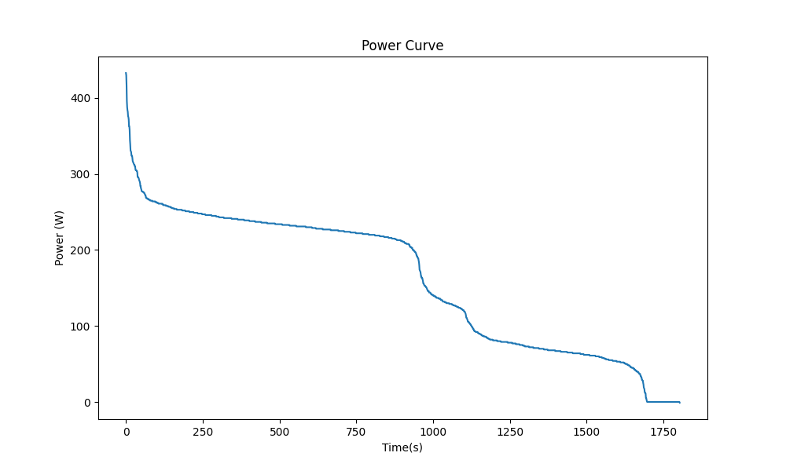

# PUE_GruppeA

## Projektübersicht 
In diesem Projekt werden Leistungsdaten aus einer CSV-Datei eingelesen, sortiert und anschließend als Leistungsdiagramm (Power Curve) dargestellt.

## Nutzung 
Damit der Code genutzt werden kann, muss zuerst das Repository geklont werden. 

Anschließend, muss PDM mit `pdm install` installiert werden. 

## Leistungsdiagramm
Nachdem Sie das Skript ausgeführt haben, finden Sie das Leistungsdiagramm (Power Curve) unter `figures/power_curve.png`.

## Beispielgrafik

