# PUE_GruppeA

## Projektübersicht 
Dieses Repository liest gegebene Leistungsdaten aus einer CSV-Datei aus, sortiert diese und erstellt dann ein Leistungsdiagramm (Power Curve).

## Nutzung 
Damit der Code genutz werden kann muss zu erst das Repository geklont werden. 

Anschließend muss PDM mit `pdm install` installiert werden. 

## Leistungsdiagramm
Nachdem Sie das Skript ausgeführt haben finden sie das Leistungsdiagramm (Power Curve) unter `figures/power_curve.png`.

## Beispielgrafik

## Aufgabe 2
Erstellen eines UML - Diagramms für Aufgabe 2

## UML-Diagramm

## Flow Chart

